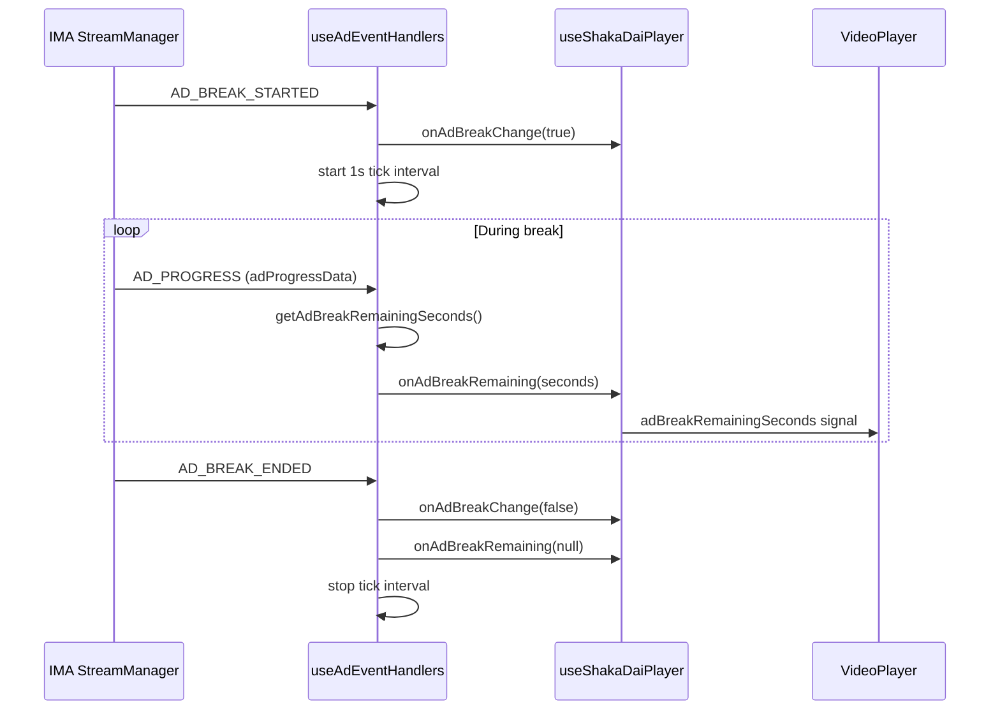

# Ad Break Countdown — Implementation Plan & Initial Advance

**Status:** Initial advance on feature branch (not required for production yet)  
**Goal:** Show a reverse timer during server-side DAI ad breaks so the user can see how much time remains before the ad pod ends (ads + slates).

---

## 1. Problem & scope

During a Google DAI live ad break, the viewer sees stitched content (real ads and filler slates) but has no indication of when normal programming resumes. This feature adds a **break-level** countdown overlay on the video player:

```
Break ends in 1:24
```

**In scope (this advance):**

- Count down the **entire ad break** (`adBreakDuration`), not only the current single ad.
- Drive timing from the **IMA DAI `StreamManager`** (official SDK path).
- Show the timer only while an ad break is active.
- Clear the timer when the break ends or the player is reset.

**Out of scope (future):**

- Per-ad countdown (`duration - currentTime` for one creative).
- Persisting timer state across channel changes without a fresh break.
- Samsung TV–specific UI layout.
- Guaranteeing accuracy on break #2+ for Ditu/Tastemade (known IMA metadata gap — see [DAI-SHAKA-INTEGRATION.md](./DAI-SHAKA-INTEGRATION.md) §6).

---

## 2. Design decisions

| Decision | Choice | Rationale |
|----------|--------|-----------|
| Data source | IMA `StreamEvent.Type.AD_PROGRESS` on `StreamManager` | Google documents this for countdown UIs; exposes `AdProgressData`. |
| Break vs ad timer | `adBreakDuration` (full pod) | User asked for time until the **ad space** ends, including multi-ad pods and slates. |
| Shaka vs IMA | Listen on `StreamManager`, not only Shaka `ad-progress` | Shaka forwards progress internally but does not expose `adProgressData` on the Shaka ad event in a reliable way for UI. |
| Elapsed time | Prefer `adPeriodDuration`; fallback to wall-clock | `adPeriodDuration` is used when sane (`0 ≤ value ≤ adBreakDuration`); otherwise elapsed = `performance.now() - breakStart`. |
| UI tick | `setInterval(1000)` while break active | Keeps countdown moving during slates when `AD_PROGRESS` may be sparse. |
| Display format | `M:SS` via `formatAdBreakCountdown()` | Simple, readable on desktop debug UI. |

### Reference (Google)

- [Create an ad countdown timer](https://developers.google.com/ad-manager/dynamic-ad-insertion/sdk/html5/countdown-timer) — uses `AD_PROGRESS` + `adProgressData` (example is per-ad; we extended to break-level).
- [AdProgressData](https://developers.google.com/ad-manager/dynamic-ad-insertion/sdk/html5/reference/js/AdProgressData) — `adBreakDuration`, `adPeriodDuration`, `adPosition`, `totalAds`, etc.

---

## 3. Architecture



### Remaining seconds calculation

**File:** `src/lib/video/adBreakCountdown.ts`

```typescript
// Primary: SDK-reported elapsed within break
remaining = ceil(adBreakDuration - adPeriodDuration)

// Fallback: wall-clock since AD_BREAK_STARTED
remaining = ceil(adBreakDuration - (now - breakStartedAt) / 1000)
```

---

## 4. Files changed (initial advance)

| File | Change |
|------|--------|
| `src/types/google-ima.d.ts` | Added `AdProgressData`, `StreamData`, `StreamEvent.getStreamData()`, `AD_PROGRESS` event type. |
| `src/lib/video/adBreakCountdown.ts` | **New** — `formatAdBreakCountdown()`, `getAdBreakRemainingSeconds()`. |
| `src/hooks/useAdEventHandlers.ts` | Extended `registerImaAdBreakListeners()` with `AD_PROGRESS`, 1s tick, `onAdBreakRemaining` callback. |
| `src/hooks/useShakaDaiPlayer.ts` | Added `adBreakRemainingSeconds` signal; wired `onAdBreakRemaining`; clear on reset/break end. |
| `src/components/features/VideoPlayer.tsx` | Overlay: “Break ends in M:SS” under the ad-break badge. |
| `src/pages/ManualAssetKeyPage.tsx` | Passes `adBreakRemainingSeconds` into `VideoPlayer`. |

### Related change on same branch (observability)

| File | Change |
|------|--------|
| `src/lib/video/interactionPings.ts` | Broadened URL match to `pagead/interaction` (covers FAST channels without `/live/` segment). |

---

## 5. UI behavior

1. **Ad break starts** (`AD_BREAK_STARTED`) → amber badge: “Ad break — playback cannot be paused”.
2. **First `AD_PROGRESS` or tick** → black badge: “Break ends in `M:SS`”.
3. **Ad break ends** (`AD_BREAK_ENDED`) → both badges hidden; `adBreakRemainingSeconds` set to `null`.
4. **Player reset / channel clear** → timer cleared.

The countdown is hidden until a numeric remaining value exists (no placeholder during the first ~second of a break).

---

## 6. Testing checklist

- [ ] Load **Tears of Steel** — wait for ad break; confirm countdown appears and reaches `0:00` near break end.
- [ ] Load **Ditu** or **Tastemade** — confirm countdown on **first** ad break (when `AD_PROGRESS` fires).
- [ ] Switch samples mid-stream — timer clears on reset; no stale countdown on next load.
- [ ] Compare countdown with wall-clock length of break (expect approximate; slates included).
- [ ] On break #2+ for real FAST channels — note whether `AD_PROGRESS` stops (same class of bug as missing interaction pings).

---

## 7. Known limitations

1. **Estimate, not frame-accurate** — `adBreakDuration` is the SDK’s maximum break length; actual pod length can differ slightly.
2. **Slates included** — Long ~30s slates on real FAST channels count toward the break window; no separate “slate vs ad” label yet.
3. **Depends on IMA progress events** — If `AD_PROGRESS` stops after the first break (Ditu/Tastemade issue), the timer will not update on later breaks either.
4. **`adPeriodDuration` semantics** — Documented sparsely by Google; fallback wall-clock handles gaps but may drift if playback stalls (mitigated by forced resume during ad breaks in this app).

---

## 8. Possible follow-ups (not implemented)

| Item | Description |
|------|-------------|
| Per-ad line | Show `Ad 2/6` using `adPosition` / `totalAds` from `AdProgressData`. |
| Slate indicator | Listen for `AD_PERIOD_STARTED` / `AD_PERIOD_ENDED` and label “Slate” vs “Ad”. |
| Dashboard event | Log countdown snapshots to Events Dashboard for debugging. |
| Samsung port | Reuse `getAdBreakRemainingSeconds()` in `caracol-samsung` once feature is needed in production. |
| Unit tests | Pure tests for `formatAdBreakCountdown` and `getAdBreakRemainingSeconds` edge cases. |

---

## 9. Merge readiness

This branch is safe to keep as an **optional advance**:

- No change to stream load, DAI session lifecycle, or interaction-ping logic beyond the observability URL fix.
- Feature is UI-only + read-only IMA listeners.
- Can be merged when product wants the countdown in the debug app or as a reference for the Samsung TV implementation.
